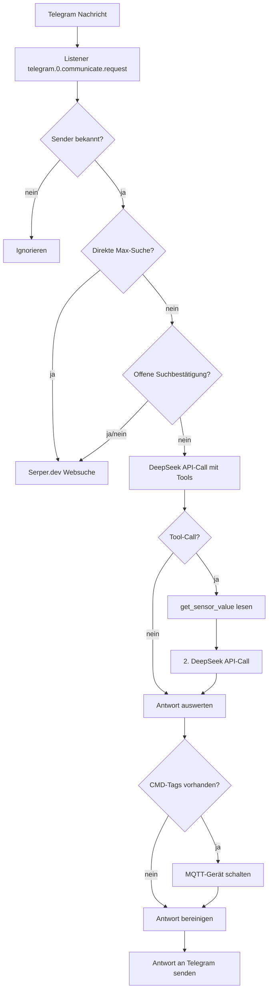

# SARAH-KI-ioBroker-Assistant
# S.A.R.A.H. – Smart Home KI-Assistentin für ioBroker

Ein JavaScript-Skript für den [ioBroker](https://www.iobroker.net/) **JavaScript-Adapter**, das dein Smart Home mit einer KI verbindet. S.A.R.A.H. (inspiriert durch die KI aus der Serie *Eureka*) beantwortet Telegram-Nachrichten, liest Sensoren aus, steuert Tasmota-Geräte per MQTT und kann über eine integrierte Websuche („Max“) aktuelle Informationen aus dem Internet holen.

> **Hinweis: Dieses Skript ist eine persönliche Vorlage – kein fertiges Produkt.**
> Alle Datenpunkte, Geräte- und Sensor-IDs sowie Namen (z. B. `DL_Angela`, `Wohnzimmer2`,
> `fb-checkpresence.1.Theo`) sind meine eigene Konfiguration. Du **musst** diese Werte an
> dein eigenes Smart Home anpassen, bevor das Skript bei dir funktioniert.

---

## Für wen ist das?

Dieses Projekt richtet sich an Nutzer mit **Grundkenntnissen in ioBroker, JavaScript und MQTT**,
die eine lauffähige Referenz für einen Telegram-/KI-Assistenten suchen – nicht an Einsteiger,
die ein Plug-and-Play-Produkt erwarten.

Du profitierst am meisten, wenn du:

- bereits einen ioBroker mit Telegram- und MQTT-Adapter betreibst,
- eigene Datenpunkt-IDs ersetzen kannst,
- verstehen möchtest, wie DeepSeek-Tool-Calling, Cache-Optimierung und MQTT-Steuerung
  in der Praxis zusammenspielen.

---

## Inhaltsverzeichnis

1. [Funktionen](#funktionen)
2. [Architektur & Ablauf](#architektur--ablauf)
3. [Voraussetzungen](#voraussetzungen)
4. [Installation](#installation)
5. [Konfiguration](#konfiguration)
6. [Steuerbare Geräte](#steuerbare-geräte)
7. [Verfügbare Sensoren](#verfügbare-sensoren)
8. [Bedienung](#bedienung)
9. [Token- & Kostenoptimierung](#token---kostenoptimierung)
10. [Sicherheit](#sicherheit)
11. [Fehlerbehebung](#fehlerbehebung)
12. [Dateiablage](#dateiablage)

---

## Funktionen

- **Telegram-Anbindung**: Textnachrichten werden automatisch beantwortet.
- **Personalisierte KI-Prompts**: Je Telegram-Nutzer ein eigener Tonfall (`benutzer_eins` / `benutzer_zwei`).
- **Sensor-Abfragen per Tool-Calling**: Wetter, Anwesenheit, Balkonkraftwerk, Lampenstatus und Uhrzeit werden *live* ausgelesen – nie geraten.
- **Hardware-Steuerung über MQTT**: Tasmota-Geräte und -Gruppen werden über `[CMD:...]`-Tags geschaltet.
- **Websuche „Max"**: Aktuelle Live-Informationen über Serper.dev – erst nach ausdrücklicher Bestätigung.
- **Wetterdienst**: Open-Meteo für Wetterdaten, Nominatim (OpenStreetMap) für den Ortsnamen.
- **Kostenoptimierung**: Stabiler System-Prompt ganz vorne + Token-Logging mit Cache-Statistik (DeepSeek-Context-Caching).
- **Verlaufsgedächtnis**: Kurzzeitgedächtnis mit Timeout, ohne unbeschränktes Token-Wachstum.

---

## Architektur & Ablauf



Die Skript-Struktur:

| Bereich | Inhalt |
|---|---|
| `1. Datenpunkte` | Automatisches Anlegen aller `0_userdata.0.*`-Zustände |
| `updateWeather()` | Wetter + Ortsname, alle 30 Minuten |
| `logTokenVerbrauch()` | Token- und Cache-Statistik |
| `2. Maps & Speicher` | `geräteMap`, `sensorMap`, Chat-Verlauf |
| `3. System Prompts & Tools` | Rollen-Prompts + `get_sensor_value`-Tool |
| `4. Haupt-Listener` | Telegram-Verarbeitung, Max-Suche, DeepSeek, MQTT |

---

## Voraussetzungen

- **ioBroker** mit laufendem **JavaScript-Adapter** (Version mit `async`/`await`- und `require('axios')`-Unterstützung).
- Adapter:
  - `telegram` – Telegram-Anbindung
  - `mqtt` – Ansteuerung der Tasmota-Geräte
  - optional `viessmannapi`, `node-red`, `fb-checkpresence` – für die jeweiligen Sensoren
- API-Keys:
  - **DeepSeek** (`https://api.deepseek.com`)
  - **Serper.dev** (`https://serper.dev`) – für die Websuche „Max"

---

## Installation

1. Skriptinhalt von `sarah3.txt` in den ioBroker-JavaScript-Adapter kopieren
   (z. B. über den Editor unter *Objekte → javascript.0 → Scripts*).
2. Skript speichern und starten.
3. Die Datenpunkte unter `0_userdata.0` werden **automatisch angelegt**.

> Hinweis: Beim ersten Start wird `axios` per `require` geladen. Sollte der `require`-Aufruf fehlschlagen, muss `axios` im JavaScript-Adapter installiert bzw. freigegeben werden.

---

## Konfiguration

Alle Werte werden über Datenpunkte im Objektbaum konfiguriert:

| Datenpunkt | Bedeutung | Standard |
|---|---|---|
| `0_userdata.0.DeepseekAPI` | DeepSeek-API-Key | leer |
| `0_userdata.0.SerperAPI` | Serper.dev-API-Key für „Max" | leer |
| `0_userdata.0.SARAH.Haushalt.Mitglieder` | Namen/Rollen der Haushaltsmitglieder für den KI-Prompt | `Person A (Bewohner), Person B (Bewohner)` |
| `0_userdata.0.Wetter.Koordinaten` | Koordinaten `Lat,Lon` für Wetter & Ortsname | `52.52,13.405` (Berlin) |
| `0_userdata.0.Wetter.Ortsname` | wird automatisch ermittelt | `Berlin` |
| `0_userdata.0.Telegramm_User_1` | Nutzerkonfiguration (JSON, siehe unten) | Template |
| `0_userdata.0.Telegramm_User_2` | Nutzerkonfiguration (JSON, siehe unten) | Template |

### Nutzerkonfiguration (Telegram)

Die Datenpunkte `Telegramm_User_1` / `Telegramm_User_2` enthalten ein JSON-Template:

```json
{
  "username": "telegram_name",
  "chatId": "chat_id",
  "rufname": "rufname",
  "promptKey": "benutzer_eins"
}
```

| Feld | Bedeutung |
|---|---|
| `username` | Telegram-Benutzername, muss mit dem Absender der Nachricht übereinstimmen |
| `chatId` | Telegram-Chat-ID |
| `rufname` | Anrede, die Sarah gelegentlich verwendet |
| `promptKey` | `benutzer_eins` (schlagfertig/ironisch) oder `benutzer_zwei` (freundlich/loyal) |

> **Wichtig**: Ohne gültige `username`-Zuordnung werden Nachrichten ignoriert.

---

## Steuerbare Geräte

Die Zuordnung erfolgt über `geräteMap`. Geräte werden über das MQTT-`cmnd`-Topic der Tasmota-Geräte geschaltet.

| Name | MQTT-Topic |
|---|---|
| `deckenlicht` | `mqtt.0.cmnd.DL_Angela.POWER1` |
| `bettlicht` | `mqtt.0.cmnd.DL_Angela.POWER2` |
| `esszimmer` | `mqtt.0.cmnd.Esszimmer.POWER` |
| `wohnzimmer` | `mqtt.0.cmnd.Wohnzimmer2.POWER` |
| `keller` | `mqtt.0.cmnd.Keller1.POWER` |

Gruppen:

| Gruppe | Enthält |
|---|---|
| `alle_lichter` | deckenlicht, bettlicht, esszimmer, wohnzimmer, keller |
| `schlafzimmer` | deckenlicht, bettlicht |

---

## Verfügbare Sensoren

Die Zuordnung erfolgt über `sensorMap`. Einzel-Sensoren:

| Name | Quelle | Einheit |
|---|---|---|
| `aussentemperatur` | Viessmann-Außentemperatur | °C |
| `wetter_temperatur` | Open-Meteo | °C |
| `wetter_feuchtigkeit` | Open-Meteo | % |
| `wetter_niederschlag` | Open-Meteo | mm |
| `wetter_wind` | Open-Meteo | km/h |
| `wetter_windrichtung` | Open-Meteo | ° |
| `balkonkraftwerk` | Node-RED `Strom_BKW` | W |
| `theo` / `angela` / `christopher` | Anwesenheit (fb-checkpresence) | – |
| `deckenlicht_status` … | MQTT-`stat`-Topics | – |
| `aktuelle_zeit` | lokal berechnet | – |

Gruppen:

| Gruppe | Enthält |
|---|---|
| `wetter` | alle Open-Meteo-Wetterwerte |
| `lichter_status` | Status aller Lampen |
| `heizung` | Außentemperatur |
| `lichtverhaeltnisse` | Balkonkraftwerk |
| `anwesenheit` | theo, angela, christopher |

---

## Bedienung

### Normale Unterhaltung

Einfach per Telegram schreiben – Sarah antwortet im konfigurierten Tonfall.

### Sensoren abfragen

Fragen wie *„Wie ist das Wetter?"* oder *„Sind die Lichter an?"* lösen automatisch einen
`get_sensor_value`-Aufruf aus. Sarah liest die Werte live aus und antwortet erst danach.

### Geräte schalten

Bei eindeutiger Absicht setzt Sarah am Ende der Antwort ein Steuer-Tag, das vom Skript in
einen MQTT-Befehl übersetzt wird:

- `[CMD:deckenlicht_on]`
- `[CMD:wohnzimmer_off]`
- `[CMD:alle_lichter_off]`

### Websuche „Max"

- Direkt: `Max, wie ist der aktuelle Strompreis?`
- Indirekt: Wenn Sarah aktuelle Daten benötigt, fragt sie erst nach Erlaubnis
  (`[FRAGE_AN_MAX: suchbegriff]`). Eine Bestätigung (`ja`, `ok`, `los` …) startet die Suche,
  eine Ablehnung (`nein`, `lass` …) bricht ab.

---

## Token- & Kostenoptimierung

- **Stabiler Prefix**: Der System-Prompt steht immer ganz vorne und bleibt unverändert –
  so greift das **DeepSeek-Context-Caching** auf wiederkehrende Nachrichten.
- **Verlaufslimit**: Es werden maximal 6 Nachrichten im Verlauf behalten.
- **Gedächtnis-Timeout**: Nach 10 Minuten Inaktivität wird der Verlauf geleert.
- **Token-Logging**: Jede Anfrage wird mit Gesamt-, Prompt-, Cache- und Antwort-Tokens geloggt:

```
[DeepSeek Token (Anfrage)] Gesamt: 1234 | Prompt gesamt: 1000 (davon Cache: 800 ⚡ / neu bezahlt: 200 💸) | Antwort: 234
```

Die Cache-Werte stammen aus den DeepSeek-Feldern `prompt_cache_hit_tokens` und
`prompt_cache_miss_tokens` (mit OpenAI-Fallback).

---

## Sicherheit

- Sarah darf **niemals ungefragt** Geräte schalten. Bei mehrdeutigen, scherzhaften oder
  widersprüchlichen Anfragen fragt sie nach, statt ein `[CMD:...]`-Tag zu senden.
- Die Websuche wird nur nach ausdrücklicher Nutzerbestätigung ausgeführt.
- Interne Tool-Aufrufe, Funktionsnamen und Steuer-Tags werden nie als Text ausgegeben.

> **Hinweis**: Die Steuer-Tags basieren auf der KI-Antwort. Bei einer Installation, die
> öffentlich erreichbar ist oder ungefilterte Webinhalte verarbeitet, empfiehlt es sich,
> zusätzlich eine serverseitige Bestätigung kritischer Aktionen zu ergänzen.

---

## Fehlerbehebung

| Problem | Ursache / Lösung |
|---|---|
| Skript startet nicht | `require('axios')` schlägt fehl → axios im JS-Adapter verfügbar machen |
| `TypeError ... .val` beim Start | Datenpunkt fehlt → Skript legt ihn beim Start an; ggf. Namespace-Rechte prüfen |
| Keine Antwort auf Telegram | `username` in `Telegramm_User_*` stimmt nicht mit dem Absender überein |
| „API-Key fehlt" | `0_userdata.0.DeepseekAPI` bzw. `0_userdata.0.SerperAPI` ist leer |
| Max-Suche schlägt fehl | Serper-Key prüfen; Serper-Limit erreicht |
| Gerät schaltet nicht | MQTT-Topic in `geräteMap` prüfen; Tasmota-Verbindung testen |
| Cache immer `0` im Log | DeepSeek liefert `prompt_cache_hit_tokens`/`prompt_cache_miss_tokens` – Logging entsprechend aktualisiert |

---

## Dateiablage

Das Skript liegt als `sarah3.txt` vor und wird in den ioBroker-JavaScript-Adapter übernommen.
Diese README liegt im selben Ordner wie das Skript.

---

## Lizenz

Dieses Projekt steht unter der **MIT-Lizenz** – vollständiger Text in [`LICENSE`](LICENSE).
Jeder darf das Skript frei verwenden, verändern und weitergeben – auch kommerziell –
solange der Lizenztext enthalten bleibt.

### Support

**Es wird kein Support angeboten.** Das Skript wird „wie besehen" (AS IS) bereitgestellt –
ohne Gewährleistung, Wartung oder Verpflichtung zu Fehlerbehebungen. Nutzung auf eigene Verantwortung.
